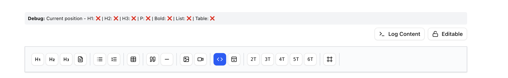
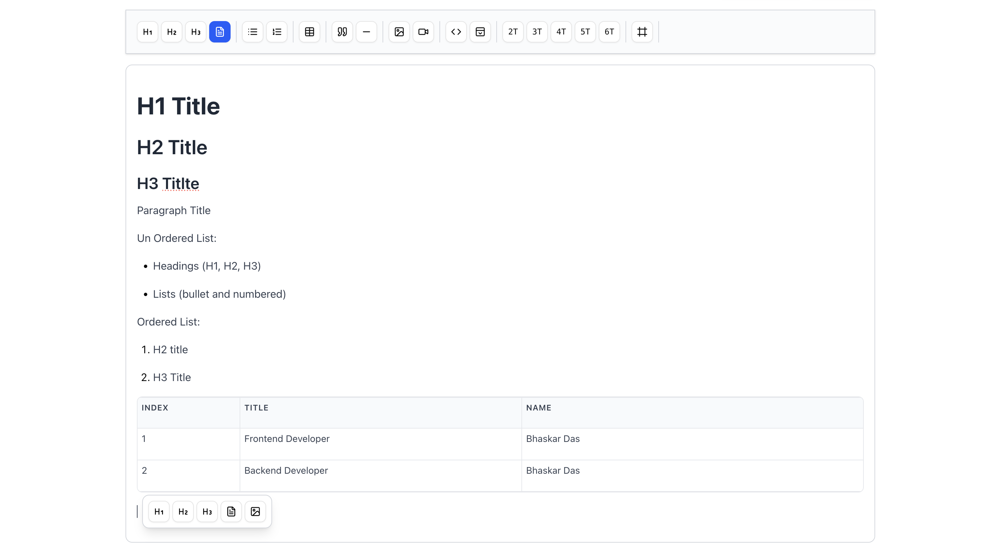
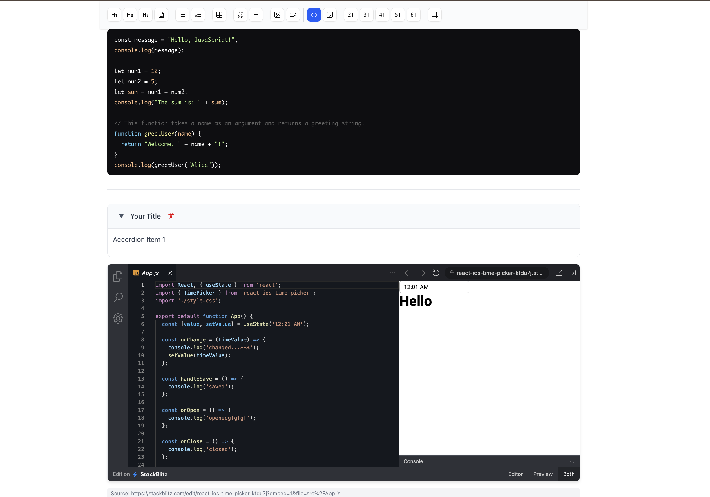
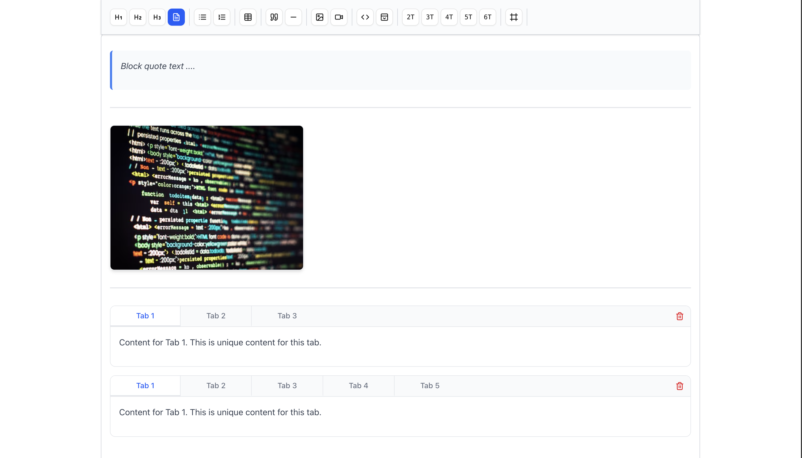

# Tiptap Editor Codeveda

A powerful, feature-rich rich text editor built with Tiptap and React. This package provides both an editor and viewer component with extensive functionality including tables, images, videos, code blocks, accordions, tabs, iframes, and more.

## 🚀 Features

- **Rich Text Editing**: Bold, italic, underline, strikethrough, headings, lists
- **Tables**: Full table support with add/delete rows and columns
- **Media Support**: Image and video uploads with preview
- **Code Blocks**: Syntax-highlighted code blocks with multiple language support
- **Interactive Components**: Accordions, tabs, iframes for CodeSandbox/YouTube
- **Customizable**: Extensible with custom extensions and styling
- **TypeScript**: Full TypeScript support with type definitions
- **Read-only Mode**: Viewer component for displaying content

# 📸 Screenshots

**If you are checking it on npm page and images not showing please check on github**

### Main Toolbar, Debug Panel and Action Buttons



### Titles, Lists and Table



### Code, Accordion and Iframe



_Image and video upload functionality with Firebase integration_

### Block, Tabs and Images



## 📦 Installation

```bash
npm install tiptap-editor-codeveda
```

## 🔧 Basic Usage

### Simple Editor

```tsx
import { TiptapEditor, useEditorContent } from "tiptap-editor-codeveda";

function MyApp() {
  const { content, html, json, setContent } = useEditorContent();

  return (
    <div>
      <TiptapEditor setEditorContent={setContent} />

      {/* Display content */}
      <div>
        <h3>HTML Output:</h3>
        <pre>{html}</pre>
      </div>
    </div>
  );
}
```

### With File Upload Support

```tsx
import { TiptapEditor, useEditorContent } from "tiptap-editor-codeveda";

function EditorWithUploads() {
  const { content, setContent } = useEditorContent();

  const handleImageUpload = async (file: File): Promise<string> => {
    // Your image upload logic here
    const formData = new FormData();
    formData.append("image", file);

    const response = await fetch("/api/upload/image", {
      method: "POST",
      body: formData,
    });

    const { imageUrl } = await response.json();
    return imageUrl;
  };

  const handleVideoUpload = async (file: File): Promise<string> => {
    // Your video upload logic here
    const formData = new FormData();
    formData.append("video", file);

    const response = await fetch("/api/upload/video", {
      method: "POST",
      body: formData,
    });

    const { videoUrl } = await response.json();
    return videoUrl;
  };

  return (
    <TiptapEditor
      setEditorContent={setContent}
      onImageUpload={handleImageUpload}
      onVideoUpload={handleVideoUpload}
    />
  );
}
```

### Read-only Viewer

```tsx
import { TiptapViewer } from "tiptap-editor-codeveda";

function ContentViewer({ htmlContent }: { htmlContent: string }) {
  return (
    <TiptapViewer editorContent={htmlContent} styles="custom-viewer-styles" />
  );
}
```

## 📖 API Reference

### TiptapEditor Props

| Prop               | Type                                      | Description                                |
| ------------------ | ----------------------------------------- | ------------------------------------------ |
| `setEditorContent` | `(content: EditorContentPayload) => void` | Callback fired when editor content changes |
| `onImageUpload`    | `(file: File) => Promise<string>`         | Optional image upload handler              |
| `onVideoUpload`    | `(file: File) => Promise<string>`         | Optional video upload handler              |

### TiptapViewer Props

| Prop            | Type     | Description                      |
| --------------- | -------- | -------------------------------- |
| `editorContent` | `string` | HTML content to display          |
| `styles`        | `string` | Optional CSS classes for styling |

### useEditorContent Hook

Returns an object with:

```tsx
{
  content: EditorContentPayload;  // Full content object
  html: string;                   // HTML string
  json: any;                      // JSON representation
  setContent: (content: EditorContentPayload) => void; // Update function
}
```

### EditorContentPayload Type

```tsx
type EditorContentPayload = {
  html: string;
  json: any; // ProseMirror JSON document
};
```

## 🎨 Styling

The editor comes with default Tailwind CSS styles. You can customize the appearance by:

1. **Override CSS classes**: The editor uses standard prose classes
2. **Custom styles**: Pass custom CSS classes to the viewer
3. **Theme customization**: Modify the default color scheme

```css
/* Custom editor styles */
.tiptap-editor {
  /* Your custom styles */
}

.tiptap-editor .ProseMirror {
  /* Editor content area */
}
```

## 🔌 Available Features

### Text Formatting

- **Headings**: H1, H2, H3
- **Text styles**: Bold, italic, underline, strikethrough
- **Lists**: Bullet points and numbered lists
- **Quotes**: Block quotes
- **Links**: Clickable links

### Advanced Components

- **Tables**: Resizable tables with header support
- **Code blocks**: Syntax highlighting for multiple languages
- **Accordions**: Collapsible content sections
- **Tabs**: Tabbed content organization
- **Iframes**: Embed CodeSandbox, YouTube, etc.

### Media

- **Images**: Upload or URL-based images with preview
- **Videos**: Upload or embed videos

## 🛠️ Examples

### Firebase Integration

```tsx
import { initializeApp } from "firebase/app";
import { getStorage, ref, uploadBytes, getDownloadURL } from "firebase/storage";

// Initialize Firebase
const app = initializeApp(firebaseConfig);
const storage = getStorage(app);

const uploadToFirebase = async (
  file: File,
  folder: string
): Promise<string> => {
  const storageRef = ref(storage, `${folder}/${Date.now()}_${file.name}`);
  const snapshot = await uploadBytes(storageRef, file);
  return await getDownloadURL(snapshot.ref);
};

function FirebaseEditor() {
  const { setContent } = useEditorContent();

  return (
    <TiptapEditor
      setEditorContent={setContent}
      onImageUpload={(file) => uploadToFirebase(file, "images")}
      onVideoUpload={(file) => uploadToFirebase(file, "videos")}
    />
  );
}
```

### Content Management

```tsx
import { useState, useEffect } from "react";
import {
  TiptapEditor,
  TiptapViewer,
  useEditorContent,
} from "tiptap-editor-codeveda";

function ContentManager() {
  const [isEditing, setIsEditing] = useState(false);
  const [savedContent, setSavedContent] = useState("");
  const { content, setContent } = useEditorContent();

  const saveContent = () => {
    setSavedContent(content.html);
    setIsEditing(false);
    // Save to your backend
  };

  return (
    <div>
      {isEditing ? (
        <div>
          <TiptapEditor setEditorContent={setContent} />
          <button onClick={saveContent}>Save</button>
          <button onClick={() => setIsEditing(false)}>Cancel</button>
        </div>
      ) : (
        <div>
          <TiptapViewer editorContent={savedContent} />
          <button onClick={() => setIsEditing(true)}>Edit</button>
        </div>
      )}
    </div>
  );
}
```

## 🤝 Contributing

Contributions are welcome! Please feel free to submit a Pull Request.

## 📄 License

MIT License - feel free to use this in your projects.

## 🐛 Issues

If you encounter any issues, please report them on the GitHub repository.

---

Built with ❤️ using [Tiptap](https://tiptap.dev/) and React.
